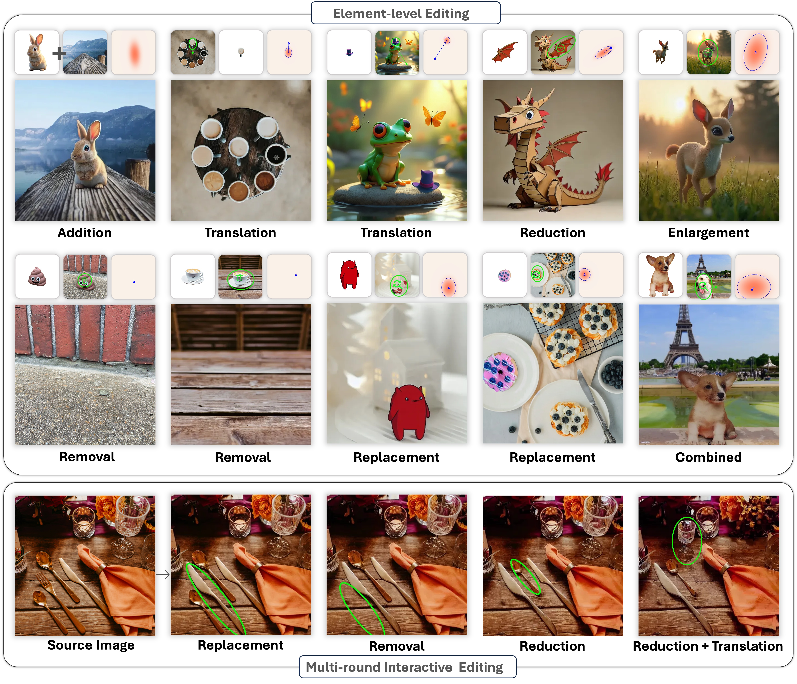

# BlobCtrl

😃 This repository contains the implementation of "BlobCtrl: Taming Controllable Blob for Element-level Image Editing".

Keywords: Image Generation, Image Editing, Diffusion Models, Element-level

> **TL;DR:** BlobCtrl enables precise, user-friendly multi-round element-level visual manipulation.  
> **Main Features:** 🦉 Element-level Add / Remove / Move / Replace / Enlarge / Shrink.

> **Authors:**  
> [Yaowei Li](https://github.com/liyaowei-stu)<sup>1</sup>, 
> [Lingen Li](https://lg-li.github.io/)<sup>3</sup>, 
> [Zhaoyang Zhang](https://zzyfd.github.io/#/)<sup>2 ‡</sup>, 
> [Xiaoyu Li](https://github.com/zhuang2002)<sup>2</sup>, 
> [Guangzhi Wang](http://gzwang.xyz/)<sup>2</sup>, 
> [Hongxiang Li](https://lihxxx.github.io/)<sup>1</sup>, 
> [Xiaodong Cun](https://vinthony.github.io/academic/)<sup>2</sup>, 
> [Ying Shan](https://www.linkedin.com/in/YingShanProfile/)<sup>2</sup>, 
> [Yuexian Zou](https://www.ece.pku.edu.cn/info/1046/2146.htm)<sup>1 ✉</sup>  
> <sup>1</sup>Peking University <sup>2</sup>ARC Lab, Tencent PCG <sup>3</sup>The Chinese University of Hong Kong <sup>‡</sup>Project Lead <sup>✉</sup>Corresponding Author


<p align="center">
  <a href="https://liyaowei-stu.github.io/project/BlobCtrl/">🌐Project Page</a> |
  <a href="http://arxiv.org/abs/2503.13434">📜Arxiv</a> |
  <a href="https://youtu.be/rdR4QRR-mbE">📹Video</a> |
  <a href="https://huggingface.co/spaces/Yw22/BlobCtrl">🤗Hugging Face Demo</a> |
  <a href="https://huggingface.co/Yw22/BlobCtrl">🤗Hugging Model</a>
  <a href="https://huggingface.co/datasets/Yw22/BlobData">🤗Hugging Data</a>
</p>


https://github.com/user-attachments/assets/ec5fab3c-fa84-4f5d-baf9-1e744f577515

Youtube Introduction Video: [Youtube](https://youtu.be/rdR4QRR-mbE).

**📖 Table of Contents**

- [BlobCtrl](#blobctrl)
  - [🔥 Update Logs](#-update-logs)
  - [🛠️ Method Overview](#️-method-overview)
  - [🚀 Getting Started](#-getting-started)
  - [🏃🏼 Running Scripts](#-running-scripts)
  - [🤝🏼 Cite Us](#-cite-us)
  - [💖 Acknowledgement](#-acknowledgement)
  - [❓ Contact](#-contact)
  - [🌟 Star History](#-star-history)

## 🔥 Update Logs
- [X] [14/11/2025] Update and polish the repo.
- [X] [20/03/2025] Release the inference code.
- [X] [17/03/2025] Release the paper, webpage and gradio demo.

## 🛠️ Method Overview

**BlobCtrl** is a framework for **element-level image editing** based on a **probabilistic blob representation**.
By treating blobs as visual primitives, BlobCtrl **disentangles layout from appearance**, enabling fine-grained and controllable object-level manipulations such as **addition, removal, scaling, and replacement**.

<p align="center">
  
</p>

## 🚀 Getting Started

<details>
<summary><b>Environment Requirement 🌍</b></summary>
<br>
BlobCtrl has been implemented and tested on CUDA121, Pytorch 2.2.0, python 3.10.15.

Clone the repo:

```
git clone git@github.com:TencentARC/BlobCtrl.git
```

We recommend you first use `conda` to create virtual environment, and install needed libraries. For example:

```
conda create -n blobctrl python=3.10.15 -y
conda activate blobctrl
python -m pip install --upgrade pip
pip install torch==2.2.0 torchvision==0.17.0 torchaudio==2.2.0 --index-url https://download.pytorch.org/whl/cu121
pip install xformers torch==2.2.0 --index-url https://download.pytorch.org/whl/cu121
pip install -r requirements.txt
```

Then, you can install diffusers and blobctrl (implemented in this repo) with:

```
pip install -e .
pip install -e diffusers

```

</details>

<details>
<summary><b>Download Model Checkpoints 💾</b></summary>
<br>
Download the corresponding checkpoints of BlobCtrl.

```
sh scripts/download_models.sh
```

**The ckpt folder contains**

- Our provided [BlobCtrl](https://huggingface.co/Yw22/BlobCtrl) checkpoints (`UNet LoRA` + `BlobNet`).
- Pretrained [SD-v1.5](https://huggingface.co/stable-diffusion-v1-5/stable-diffusion-v1-5) checkpoint.
- Pretrained [DINOv2](https://huggingface.co/facebook/dinov2-large) checkpoint.
- Pretrained [SAM](https://dl.fbaipublicfiles.com/segment_anything/sam_vit_h_4b8939.pth) checkpoint.

The checkpoint structure should be like:

```
|-- models
    |-- blobnet
        |-- config.json
        |-- diffusion_pytorch_model.safetensors
    |-- dinov2-large
        |-- config.json
        |-- model.safetensors
        ...
    |-- sam
        |-- sam_vit_h_4b8939.pth
    |-- unet_lora
        |-- pytorch_lora_weights.safetensors
```

</details>

## 🏃🏼 Running Scripts

<details>
<summary><b>BlobCtrl demo 🤗</b></summary>
<br>
You can run the demo using the script:

```
sh scripts/run_app.sh
```

</details>

<details>
<summary><b>BlobCtrl Inference 🌠</b></summary>
<br>
You can run the inference using the script:

```
sh scripts/inference.sh
```

</details>

## 🤝🏼 Cite Us

```
@article{li2025blobctrl,
  title={BlobCtrl: Taming Controllable Blob for Element-level Image Editing},
  author={Li, Yaowei and Li, Lingen and Zhang, Zhaoyang and Li, Xiaoyu and Wang, Guangzhi and Li, Hongxiang and Cun, Xiaodong and Shan, Ying and Zou, Yuexian},
  journal={arXiv preprint arXiv:2503.13434},
  year={2025}
}
```

## 💖 Acknowledgement

Our implementation builds upon the [diffusers](https://github.com/huggingface/diffusers) library. We extend our sincere gratitude to all the contributors of the diffusers project!

We also acknowledge the [BlobGAN](https://github.com/dave-epstein/blobgan) project for providing valuable insights and inspiration for our blob-based representation approach.

## ❓ Contact

For any question, feel free to email `liyaowei01@gmail.com`.

## 🌟 Star History

<p align="center">
    <a href="https://star-history.com/#TencentARC/BlobCtrl" target="_blank">
        
    </a>
<p>
